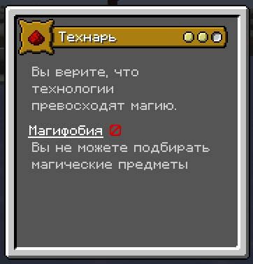
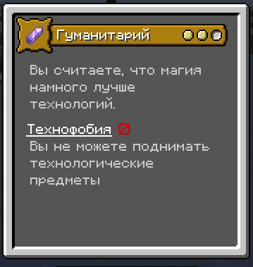

 

<h1> The Tech vs. Magic War: Origins addon </h1>
<a style="text-decoration: none;" href="https://steamcommunity.com/id/H0dytrapl/" alt="link">Steam</a>

**Мод: Origins. Поддержка: 1.20.2+ . Тип: датапак**

О проекте
======
Датапак добавляет технарей и гуманитариев(магов). для выживания на техномагических сборках с друзьями.

!ВАЖНО!
======
``установите языковой ресурспак!``

Происхождения
======

Примечания
======

``датапак находиться в разработке.
ждем когда мод выйдет в релиз, тогда доделаю.``

``можете использовать датапак и ресурспак с переводом как шаблон для своих датапаках по origin``

